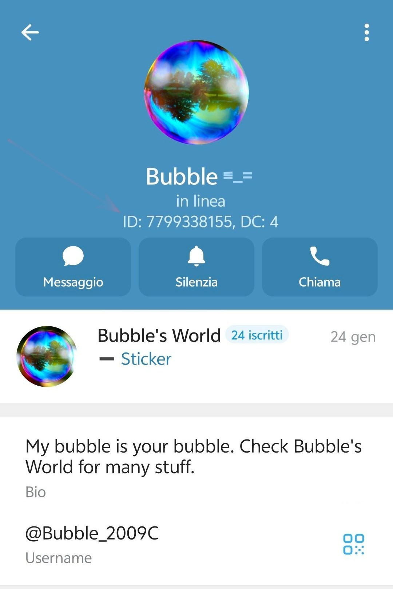
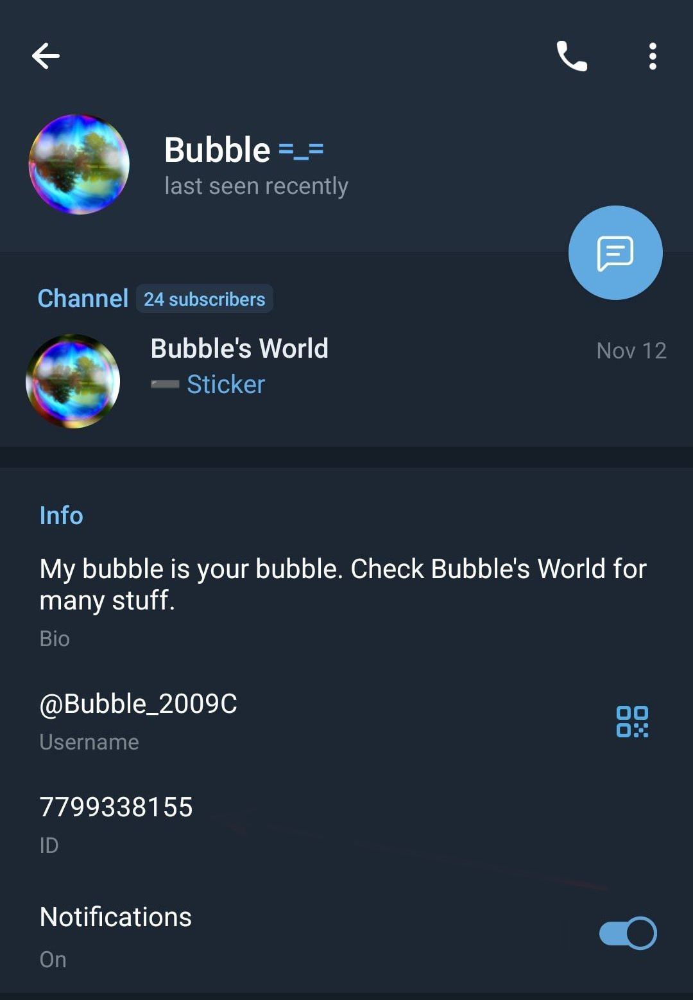
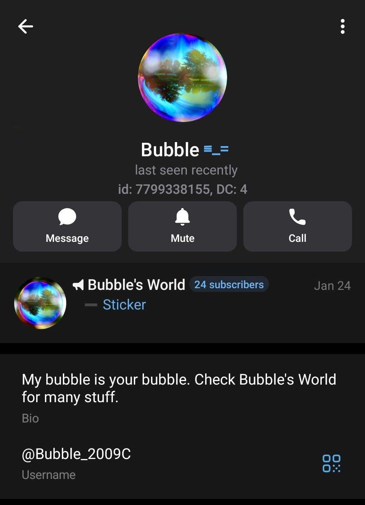
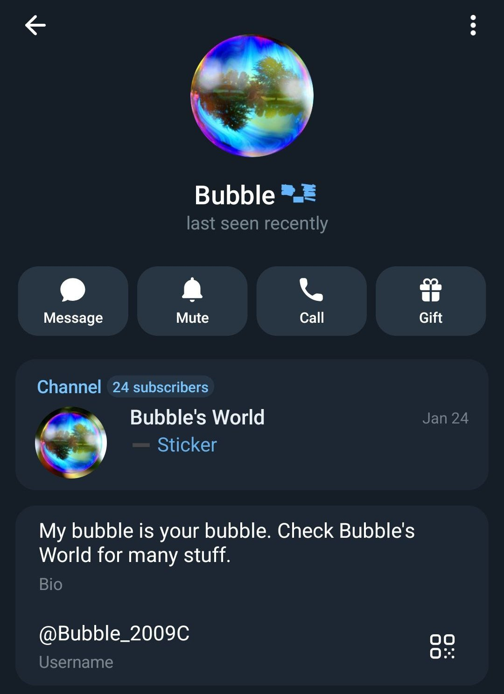

# Account Falsi, identifichiamoli tramite l'**ID**

Telegram è un sistema di messaggistica che si basa su un numero di Telefono. Questo vuol dire che per registrarvi, dovete inserire un numero di telefono valido. 
Il numero di telefono, però, non viene mostrato (sempre che abbiate regolato bene il livello della vostra privacy come visto in un altra guida) a meno che non lo abbiate già salvato nella vostra rubrica.

Questa caratteristica, però, fa si che si possano creare due (o più) account *quasi identici*. 
Purtroppo, alcune entità malevoli, utilizzano questa cosa per creare account che tentano di emulare account noti. 
In utile dire che chi crea questi account **lo fa solo e soltanto per scopi malevoli**, unicamente per cercare di sottrarvi qualcosa (soldi, dati personali o quant'altro).

Voglio però informarvi che **è possibile difendersi da questi individui**. 
Ora vi spiego come potete tutelarvi da questo tipo di truffa. 
Vedremo tre tecniche, tutte e tre molto utili per identificare i truffatori:
* [L'**ID**](#come-poter-visualizzare-lid-di-un-account-telegram-)
* L'**username**
* I gruppi in comune

Dovete infatti sapere che su Telegram, l'**ID** e l'**username** sono assolutamente univoci. Vediamo quindi come utilizzare questi elementi a nostro vantaggio.

## **ID**

Come ho scritto sopra, per potervi registrare a Telegram, dovete inserire un numero di telefono, ma, **il vostro account**, in realtà, **non è il vostro numero di telefono**. 
Telegram crea per ogni utente un **ID** univoco che è si legato al vostro numero di Telefono, ma in realtà, voi potete anche aggiornare il numero associato a Telegram, senza però cambiare questo **ID**.

### Come poter visualizzare l'**ID** di un account telegram ?
Ecco un'ottima domanda. L'app ufficiale di Telegram, non visualizza l'**ID** degli utenti. Ci sono, però, tante altre app che utilizzando le API di Telegram, offrono una esperienza utente migliore. 
Onestamente parlando, però, non so dirvi se queste app esistono anche dell'ecosistema della mela morsicata, però, su Android, ne esistono parecchie e molto valide, di seguito alcuni esempi (che aggiornerò nel tempo)

* :link: [Plus Messenger](https://play.google.com/store/apps/details?id=org.telegram.plus&hl=en-US)
    * secondo me uno dei migliore client Telegram mai esistiti, con solo due difetti:
        * non è open source
        * recentemente hanno introdotto delle pubblicità, facilmente bypassabili con TOR o con un :link:[AdBlock Open Source](https://github.com/AdAway/AdAway);
* :link: [NekoGram](https://github.com/Nekogram/Nekogram)
    * OpenSource e scaricabile da PlayStore, ma vi suggerisco di scaricarlo dal loro canale Telegram:
        * :link:[Aggiornamenti](https://t.me/nekoupdates)
        * :link:[Download APK](https://t.me/NekoTestAPKs)
* *other coming soon*

Con queste App, andando sul profilo di un utente, vedrete, oltre ai soliti dati, anche l'**ID** che può essere mostrato in svariati modi:

Nekogram:

***
Mercurygram

***
Plus Messenger

***

L'**ID** è il sistema migliore per identificare un truffatore.
Nel caso in cui, però, non abbiate la possibilità di installare un differente client Telegram (o perchè avete un iPpone o perchè non siete in grado) c'è un altro modo per identificare l'ID di un utente.

Quella che segue è come vedete la normale videata di un contatto con applicativo standard di Telegram:

Quello che vedete indicato dalla freccia, è l'**username** che vedremo nel secondo punto. In questo caso, però, ci serve per identificare l'**ID** nel caso utilizziate l'applicazione standard di Telegram.

Intanto diffidate di chi vi contatta senza **ID**, ma, soprattutto, se la persona di cui sta copiando le sembianze ha un **ID**, avete l'immediata conferma *che sia un account fake*.

Purtroppo ho fatto la triste scoperta che con Telegram standard, premendo sull'**username** questo non viene copiato come accade con client alternativi, pertanto dovete trascriverlo.

Una volta trascritto, avviate il bot ***CaptainIDBot***, potete farlo contattandolo tramite username: [@CaptainIDBot](t.me/CaptainIDBot) oppure tramite link: :link:[t.me/CaptainIDBot](https://t.me/CaptainIDBot)

Una volta Avviato il BOT, vi comparirà il Vs. nome Telegram ed il Vs. **ID** Telegram, ma quello che interessa a noi è quello che ci può dire interrogandolo.

Se copiate un username (nel mio caso @Bubble_2009C) il Bot vi restituirà il mio **ID** 

Ora che in un modo o nell'altro abbiamo l'**ID** non ci resta che confrontarlo con l'utente che noi immaginiamo che ci stia contattando.
Ovviamente dovete cercare quell'utente in un gruppo in cui siete sicuri che abbia scritto l'utente vero (e non il presunto clone).

Se i due **ID** corrispondono, allora potete avete la certezza che l'utente sia il medesimo.

Vediamo ora la parte riguardante l'**username**.
