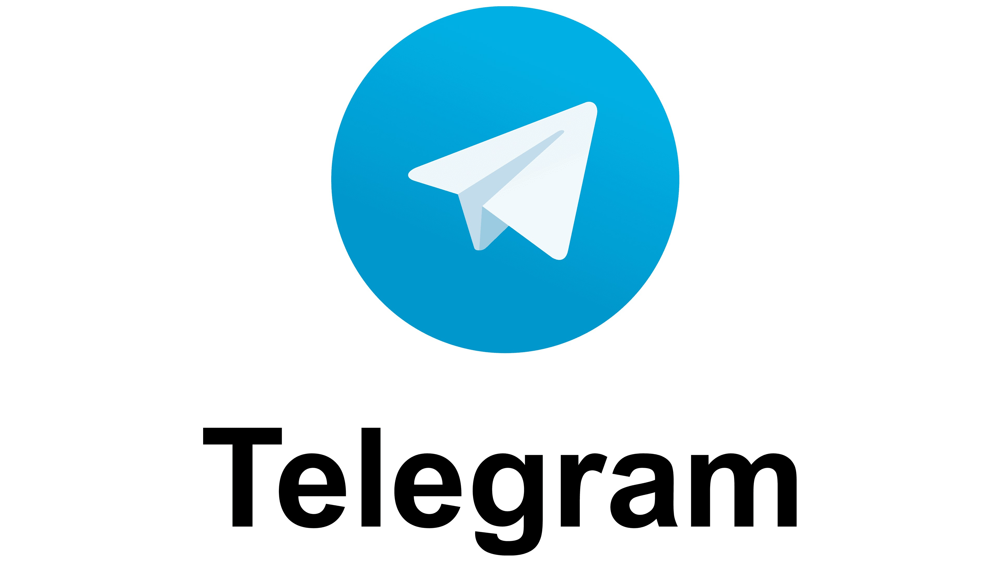

# Telegram, consigli per un utilizzo consapevole

Telegram è un bellissimo sistema di messaggistica. 
Se solo la gente riuscisse a comprenderlo meglio, manderebbe in pensione definitivamente WhatsApp.

Come in tutte le tecnologie moderne ci sono i lati belli, ma anche quelli negativi; la mia speranza è che tramite questa guida, riusciate ad utilizzarlo al meglio.

Ho tante idee, quindi sarà lunga svilupparle tutte, inizierò con quelle che penso siano le più urgenti da affrontare. 
Nel caso vogliate suggerirmi argomenti da affrontare, troverete in fondo tutti i contatti.

Ecco gli argomenti che ho intenzione di affrontare. 
Quando a fianco dell'argomento trovare il simbolo :link:, significa che è già presente una guida. Per le altre, portate pazienza, arriveranno anche loro.

### Le Guide
* :link: [Consigli per identificare utenti fake](fake.md) *(vediamo come tutelarci dagli scam)*;
* Prevenire il furto di account;
* Inserire un username;
* Alzare il livello di privacy del vostro account;
* Come evitare di esaurire lo spazio del telefono.

***
| | |
| :------- | :--------: |
|  Come sempre invito chiunque voglia commentare a farlo liberamente, accetto volentieri C&C che possano arricchire e/o correggere questo scritto. Ho buttato tutto giù di getto, pertanto segnalatemi anche qualsiasi tipo di errore.   Per parlare con me di questa guida, unitevi al :link:[mio gruppo telegram](https://t.me/+GlEaD0WD53BmNGE0).|  |

