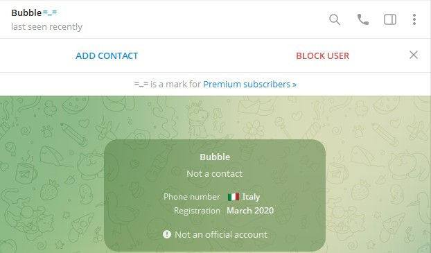

# Account Falsi, come difenderci.

Telegram è un sistema di messaggistica che si basa su un numero di Telefono. Questo vuol dire che per registrarvi, dovete inserire un numero di telefono valido. 
Il numero di telefono, però, non viene mostrato (sempre che abbiate regolato bene il livello della vostra privacy come visto in un altra guida) a meno che non lo abbiate già salvato nella vostra rubrica.

Questa caratteristica, però, fa si che si possano creare due (o più) account *quasi identici*. 
Purtroppo, alcune entità malevoli, utilizzano questa cosa per creare account che tentano di emulare account noti. 
In utile dire che chi crea questi account **lo fa solo e soltanto per scopi malevoli**, unicamente per cercare di sottrarvi qualcosa (soldi, dati personali o quant'altro).

Voglio però informarvi che **è possibile difendersi da questi individui**. 
Ora vi spiego come potete tutelarvi da questo tipo di truffa. 
Vedremo tre tecniche, tutte e tre molto utili per identificare i truffatori:

* [Primo contatto](#primo-contatto)
* [L'**username**](#lusername)
* [L'**ID**](#come-poter-visualizzare-lid-di-un-account-telegram-)
* [I gruppi](#gruppi-in-comune)
* [Segnalare gli impostori](#segnalare-gli-impostori)

Dovete infatti sapere che su Telegram, l'**ID** e l'**username** sono assolutamente univoci. Vediamo quindi come utilizzare questi elementi a nostro vantaggio. 
I gruppi in comune, invece, sono una indicazione veloce che potete avere, ma non è possibile avere una certezza.

## Primo Contatto
Recentemente Telegram ha introdotto un sistema di notifica per chi vi contatta per la prima volta. 
Questa prima schermata ci aiuta moltissimo a capire se ci sta contattando un utente reale oppure un utente che vuole truffarci. 
Vediamola insieme:

Questa schermata appare solo la prima volta che un utente vi contatta ed oltretutto scompare dopo pochi giorni. 
Al centro di questa schermata, potete vedere alcune informazioni, tra cui la nazione del numero di telefono che ho utilizzato per registrare il mio account, quando ho registrato l'account ed in questo caso poco altro.

Vediamo un'altra schermata:

In questo schermata, oltre alle informazioni viste prima, possiamo anche vedere che abbiamo 4 gruppi in comune. 
Questa è già una indicazione molto importante sulla veridicità dell'account, ma di seguito vedremo metodi più deterministici.

Appena mi contatterà uno scammer, vi pubblicherò lo screenshot per farvi notare altre incongruietà. 
Se vi dovesse capitare e mi voleste condividere lo screenshot, mi dareate una grande mano.

Vediamo ora i metodi deterministici.

## L'**username**
Penso che tutti (o quasi) abbiano sentito parlare dell'**username**. 
Alcuni gruppi obbligano gli iscritti ad avere un **username** proprio perchè tramite questo è possibile identificare in maniera univoca un utente.  
Per chi non sapesse come aggiungere l'username al proprio account può guardare questa altra guida. (*devo ancora scriverla, poi aggiungerò il link*)

Tramite l'username voi sarete in grado ci capire se un contatto che vi scrive è autentico o meno.
Andando a vedere il profilo dell'utente che vi scrive, vi apparirà una cosa simile:

Quella di sopra è la schermata del mio utente Telegram. La schermata è stata fatta con la versione di Telegram ufficiale, scaricata dal Google Play Store. 
Come vedremo in seguito, esistono client alternativi a quello stock che integrano alcuni utili funzioni, ma per il momento, Telegram stock va più che bene. 
La maggior parte dei profili che vedrete, non avrà un canale personale nel profilo, ma, in questo momento a non non interessa. 
Quello che ci interessa è la parte seguente. Nell'immagine potete vedere la **bio** e sotto ancora l'**username**.

Questo è l'**username** di cui parlavo prima. 
Questo è univoco, non troverete nessuno con il vostro stesso **username**, ma potreste trovarne di simili.

Uno scammer, infatti, potrebbe provare a falsificare l'**username** utilizzando caratteri simili. 
Provo a farvi un esempio: `Carlo` e `Car1o` possono sembrare molto simili, soprattutto se viene utilizzato un carattere più arrotondati. 
Allo stesso modo, sfruttando sempre il solito sfortunato, uno scammer, al posto di  `CARLO` potrebbe provare a scrivere `CARL0`. Nell'esempio è molto marcata la differenza, ma se togliessi questa formattazione, CARLO e CARL0 diventerebbero molto simili.

Quindi, confrontando l'**username** di chi vi ha contattato, con l'**username** del utente di cui siete sicuri dell'identità, potete scoprire se si tratta sicuramente di lui, oppure no.

### Come trovare il vero **username** di un utente?
Andate a cercare un suon messaggio in una chat in cui lo avete visto scrivere. 
Possibilmente cercate un messaggio anche datato, perchè, il vostro ipotetico attaccante, potrebbe aver creato l'account "**clone**" e iniziato ad usarlo nei vari gruppi per mimetizzarsi. Se così fosse, però, si tratterebbe di messaggi recenti, perchè, altrimenti, sarebbe già stato segnalato, bannato e i suoi messaggi cancellati.

C'è però un modo per fare la medesima verifica con solo numeri, togliendo così il problema di confondere le lettere. 
Vediamo come:

## L'**ID**
Come ho scritto sopra, per potervi registrare a Telegram, dovete inserire un numero di telefono, ma, **il vostro account**, in realtà, **non è il vostro numero di telefono**. 
Telegram crea per ogni utente un **ID** univoco che è si legato al vostro numero di Telefono, ma in realtà, voi potete anche aggiornare il numero associato a Telegram, senza però cambiare questo **ID**.

### Come poter visualizzare l'**ID** di un account telegram ?
Ecco un'ottima domanda. L'app ufficiale di Telegram, non visualizza l'**ID** degli utenti. Ci sono, però, tante altre app che utilizzando le API di Telegram, offrono una esperienza utente migliore. 
Onestamente parlando, però, non so dirvi se queste app esistono anche dell'ecosistema della mela morsicata, però, su Android, ne esistono parecchie e molto valide, di seguito alcuni esempi (che aggiornerò nel tempo)

* :link:[Plus Messenger](https://play.google.com/store/apps/details?id=org.telegram.plus&hl=en-US)
    * secondo me uno dei migliore client Telegram mai esistiti, con solo due difetti:
        * non è open source
        * recentemente hanno introdotto delle pubblicità, facilmente bypassabili con TOR o con un :link:[AdBlock Open Source](https://github.com/AdAway/AdAway);
* :link:[NekoGram](https://github.com/Nekogram/Nekogram)
    * OpenSource e scaricabile da PlayStore, ma vi suggerisco di scaricarlo dal loro canale Telegram:
        * :link:[Aggiornamenti](https://t.me/nekoupdates)
        * :link:[Download APK](https://t.me/NekoTestAPKs)
* :link:[ForkGram](https://github.com/forkgram/TelegramAndroid) aka `Fork Client` oppure anche `Telegram FOSS`
    * OpenSource, scaricabile da :link:[F-Droid](https://f-droid.org/packages/org.forkgram.messenger/);
    * Presenta pochissime differenze da quello "*ufficiale*" presente sul PlayStore
* *other coming soon*

Con queste App, andando sul profilo di un utente, vedrete, oltre ai soliti dati, anche l'**ID** che può essere mostrato in svariati modi:

Nekogram:

***
Mercurygram

***
Plus Messenger

***

L'**ID** è il sistema migliore per identificare un truffatore.
Nel caso in cui, però, non abbiate la possibilità di installare un differente client Telegram (o perchè avete un iPpone o perchè non siete in grado) c'è un altro modo per identificare l'ID di un utente.

Quella che segue è come vedete la normale videata di un contatto con applicativo standard di Telegram:

Quello che vedete indicato dalla freccia, è l'**username** che vedremo nel secondo punto. In questo caso, però, ci serve per identificare l'**ID** nel caso utilizziate l'applicazione standard di Telegram. 
Vi consiglierei di diffidare di chi contatta senza **username**. Un primo controllo, sarebbe quindi verificare se la persona **di cui sta copiando le sembianze** ha un **username**, avrete l'immediata conferma *che sia un account fake*.

Per verificare identificare l'**ID** vi consiglio di utilizzare il bot ***CaptainIDBot***. Vi suggerisco questo perchè è stato programmato da un utente noto nella comunità: [*Gιᥙsᥱρρᥱ "ᥲkᥲ" gιᥙxfιᥣᥲ*](https://t.me/giuxfila).

Purtroppo ho fatto la triste scoperta che con Telegram standard, premendo sull'**username** questo non viene copiato come accade con client alternativi, pertanto dovete trascriverlo.

Una volta trascritto, avviate il bot ***CaptainIDBot***, potete farlo contattandolo tramite username: [@CaptainIDBot](https://t.me/CaptainIDBot) oppure tramite link: :link:[t.me/CaptainIDBot](https://t.me/CaptainIDBot)

Una volta Avviato il BOT, vi comparirà il Vs. nome Telegram ed il Vs. **ID** Telegram, ma quello che interessa a noi è quello che ci può dire interrogandolo.

Se scrivete in chat un username (nel mio caso @Bubble_2009C) il Bot vi restituirà il suo **ID** 

Ora che in un modo o nell'altro abbiamo l'**ID** non ci resta che confrontarlo con l'**ID** dell'utente che noi immaginiamo ci stia contattando.
Ovviamente dovete cercare quell'utente in un gruppo in cui siete sicuri che abbia scritto l'utente vero (e non il presunto clone) ed eseguire la stessa operazione con ***CaptainIDBot***.

Se i due **ID** corrispondono, allora potete avete la certezza che l'utente sia il medesimo, diversamente bloccate e segnalate.

Per capire dove cercare un messaggio dell'utente "*originale*" potete cercare nei gruppi che avete in comune:

## Gruppi in Comune
Sempre andando sui dettagli utente tramite Telegram, avete la possibilità di visionare i gruppi che avete in comune. 
A cosa vi serve saperlo? 
Partite da questo presupposto, siete nel gruppo ***PIPPO*** vi scrive uno che vi dice una cosa del genere: 
        "*Sono del supporto tecnico di PIPPO, mi è stato affidato il tuo caso*"
Ecco, un messaggio del genere è **SCAM al 99,9%**, se volete dare una minima possibilità al tipo, verificare i gruppi che avete in comune. 
In pratica, se l'utente dice di essere del gruppo *PIPPO* e non lo vedere nel gruppo *PIPPO* allora bloccatelo immediatamente.

Guadare i gruppi che avete in comune, sono un indice della veridicità del contatto, ma non sono una prova certa. 
Non basatevi solo su questa prova per controllare la veridicità di un account che vi contatta.

## Segnalare gli impostori
Telegram mette a disposizione un bot ufficiale per segnalare gli account degli impostori. 
Segnalare questi scammer è un dovere per la comunità.

***
[Qui per tornare all'elenco delle guide.](README.md)