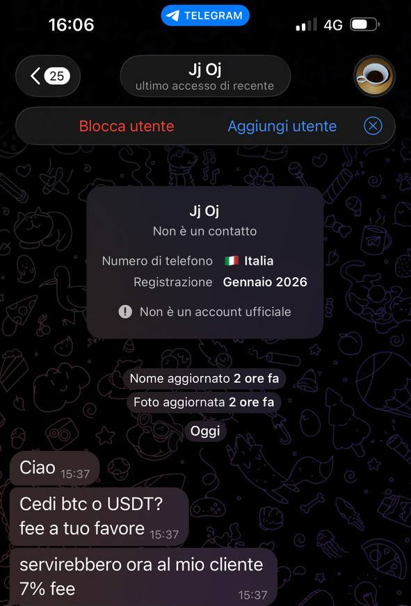

# Gli SCAMMER
Come promesso, quì posterò tutti gli scammer di cui verro a conoscenza. 
Per ogni scammer che posterò, aggiungerò alcune righe per spiegare come identificare che è uno scammer. 
Dividerò in due gruppi le segnalazioni:
1. [Scammer che impersonano altri utenti](#scammer-che-impersonano-altri-utenti);
2. [Scammer che vogliono solo truffarvi](#scammer-che-vogliono-solo-truffarvi).
***
## Scammer che impersonano altri utenti

### Aramis
Ecco la prima videata.

### Jj Oj
Ecco la prima videata.

Vi contatta questo individuo che si fa passare per **Jj Oj**. 
Il vero **Jj Oj** è un utente molto conosciuto nei mercatini di Telegram. 
Se questo scammer vi contatta, è perchè probabilmente vi ha visto in quei mercatini. 
Ci sono tre cose in questa videata che ci devono mettere **IMMEDIATAMENTE** in allerta.
1. La registrazione dell'account: **Gennaio 2026** 
provate a pensare da quanto tempo vedete quell'utente nei gruppi.  **Jj Oj** sicuramente prima di Gennaio 2026. 
Ecco il primo punto che ci fa capire che questo **non è Jj Oj** che ci contatta;
2. Nome e Foto aggiornate **2 ore fa** 
Seconda cosa che ci fa capire che si tratta di un account SCAM. 
Ragionate da quanto tempo vedete quell'utente scrivere nei gruppi, ragionate da quanto tempo vedete quella foto relativa a quell'utente. 
Altro indizio che ci fa capire che questo **non è Jj Oj**.
2. Se conoscete il mercato Crypto, saprete benissimo che le fee sono sempre a favore di chi vende Cryptovaluta. Quella proposta è fatta unicamente per abbindolarvi.

Appena un utente con queste incongruenze vi contatta, vo dovete fare lo screenshot della chat, del suo profilo, reperire il suo ID e poi:

1. bloccare e segnalare
2. avvisare l'utente reale che qualcuno stà cercando di emularlo
3. dire all'utente reale di segnalare il furto di identità tramite il bot che abbiamo visto prima. :link:[NoToScam](https://t.me/notoscam)

***
## Scammer che vogliono solo truffarvi

### Stephanie

Vediamo questo profilo:

Analizziamo le informazioni che ci appaiono e cerchiamo di capire cosa non torna in quello che vediamo.
1. Esattamente come visto in precedenza, **nome e foto** aggiornate da pochissimo (2 giorni fa). 
Altra cosa sospetta è che la foto non è visibile. 
2. **USA**, la persona ha un numero americano. 
Scrive alle 11, il che significa che in America sono le 5 sulle East Coast (New York) e le 3 sulla West Coast (Los Angeles). 
Un orario molto sospetto a cui scrivere a qualcuno, non trovate?
3. L'**incipit**. "*Mi hai bloccato*". 
Se ho bloccato un contatto, come fa a scrivermi? 
Ma soprattutto, se veramente mi conoscesse, perchè non chiamarmi per nome?

Ora, se avete voglia di "*giocare*" un po' con lo scammer, provate a scrivergli un po', portandolo a tradirsi e a smascherarsi. 
Diversamente bloccate e segnalate immediatamente, non state a perdere tempo.

***
[Qui per tornare all'elenco delle guide.](../README.md)
| | |
| :------- | :--------: |
|  Come sempre invito chiunque voglia commentare a farlo liberamente, accetto volentieri C&C che possano arricchire e/o correggere questo scritto. Ho buttato tutto giù di getto, pertanto segnalatemi anche qualsiasi tipo di errore.   Per parlare con me di questa guida, unitevi al Gruppo Telegram :link:[ABC del Bitcoin](https://t.me/+GlEaD0WD53BmNGE0).|  |
