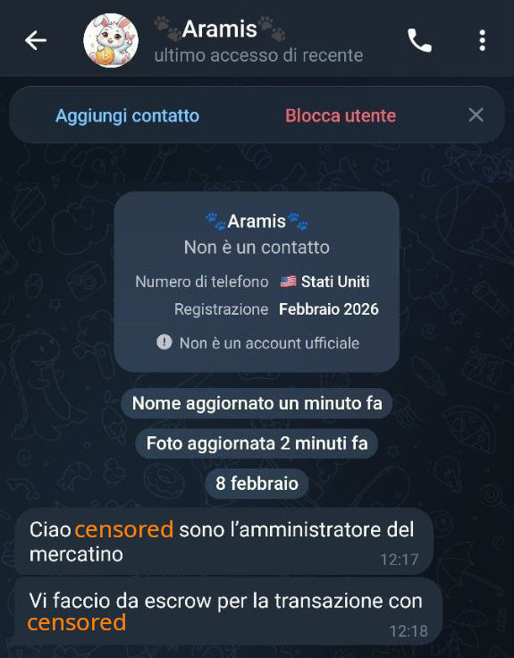
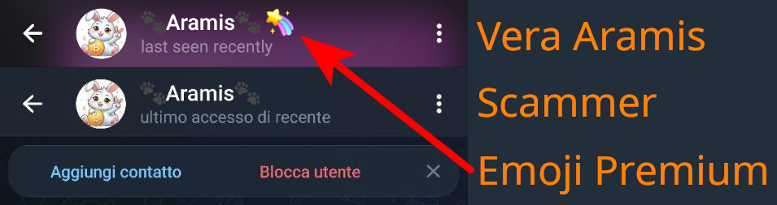
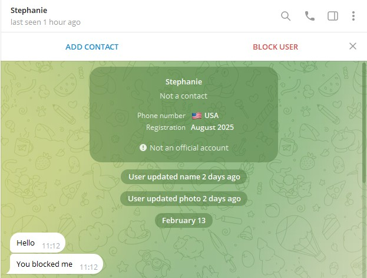

# Gli SCAMMER
Come promesso, quì posterò tutti gli scammer di cui verro a conoscenza. 
Per ogni scammer che posterò, aggiungerò alcune righe per spiegare come identificare che è uno scammer. 
Dividerò in due gruppi le segnalazioni:
1. [Scammer che impersonano altri utenti](#scammer-che-impersonano-altri-utenti);
2. [Scammer che vogliono solo truffarvi](#scammer-che-vogliono-solo-truffarvi).
***
## Scammer che impersonano altri utenti

### Aramis
Ecco la prima videata.

Vi contatta qualcuno che si che si fa passare per **🐾Aramis🐾**. 
La vera **🐾Aramis🐾** è molto conosciuta nei mercatini di Telegram. 
Se questo scammer vi contatta, è perchè probabilmente vi ha visto in quei mercatini. 

In questa videata ci sono un po' di cose che vi devono mettere **IMMEDIATAMENTE** in allerta. 
Vediamole insieme:
1. La registrazione dell'account: 
**Febbraio 2026** e vi contatta l'8 Febbraio. Un account nuovissimo. 
**🐾Aramis🐾** bazzica i gruppi telegram sicuramente da molto prima di Febbraio 2026. 
Già da questo possiamo capire che non ci sta contattando la vera **🐾Aramis🐾**;
2. Nome e Foto aggiornate **1 minuto fa**: 
Seconda cosa che ci fa capire che si tratta di un account SCAM. 
**🐾Aramis🐾** ha come immagine (ProPic) quel grazioso coniglietto da tanto tempo;  pensate da quanto tempo vedete quell'utente con quella immagine profilo nei gruppi e arriverete a comprendere che chi ci contatta non è **🐾Aramis🐾**;
3. **🐾Aramis🐾** non fa da escrow nelle transazioni, quindi lo scammer vi sta proponendo un servizio che il vero utente non vi proporrà mai;
4. **🐾Aramis🐾** è una fanciulla, non parlerebbe rivolgendosi a se stessa in modo maschile;
5. **🐾Aramis🐾** ha telegram Premium, pertanto accanto al suo nome, viene visualizzata anche una emoji utilizzabile solo da chi ha un abbonamento premium attivo. 

Questo è per farvi capire che, fin dalla prima videata, potete identificare uno scammer. 
Se poi volete avere la completa certezza, potete effettuare i passaggi mostrati nella guida :link:[Riconoscere account Telegram Falsi](./fake_it.md)

In questo specifico caso, il fatto che ci contatti un numero americano, potrebbe non essere significativo. 
Molti amanti della privacy, infatti, utilizzano numeri "anonimi". 
Vedremo in seguito come, in altri casi, questo, invece, sarà un fattore importante.

Appena un utente con queste incongruenze vi contatta, dovete fare lo screenshot della chat, del suo profilo, reperire il suo ID e poi:

1. bloccare e segnalare l'utente in questione con i tasti comparsi in alto nella chat;
2. avvisare l'utente reale che qualcuno stà cercando di emularlo;
3. invitare l'utente reale di segnalare il furto di identità tramite il bot :link:[NoToScam](https://t.me/notoscam) che abbiamo visto prima.

***
## Scammer che vogliono solo truffarvi

### Stephanie

Vediamo questo profilo:

Analizziamo le informazioni che ci appaiono e cerchiamo di capire cosa deve farci drizzare le orecchie in quello che vediamo:
1. Esattamente come visto in precedenza, **nome e foto** sono state aggiornate da pochissimo (2 giorni fa). 
Altra cosa sospetta è che la foto non è visibile, quindi possiamo supporre che la foto sia stata cancellata. 
2. **USA**, la persona ha un numero americano e dice di contattarci dall'America. 
Scrive alle ore 11 di mattina, ora Italiana, il che significa che in America sono le 5 sulle East Coast (New York) e le 3 sulla West Coast (Los Angeles). 
Un orario molto sospetto a cui scrivere a qualcuno, non trovate?
3. L'**incipit**. "*Mi hai bloccato*". 
Se realmente avessi bloccato un contatto, questo non potrebbe scrivermi. 
Ma soprattutto, se veramente mi conoscesse, perchè non chiamarmi per nome?

Ora, se avete voglia di "*giocare*" un po' con lo scammer, potete provare a rispondere per un po', portandolo a tradirsi e a smascherarsi da solo con delle incongruenze. 
Se, invece, non avete tempo da perdere, bloccate e segnalate immediatamente.

***
[Qui per tornare all'elenco delle guide.](../README.md) 
Qui per tornare alla guida [Riconoscere account Telegram Falsi](./fake_it.md)
| | |
| :------- | :--------: |
|  Come sempre invito chiunque voglia commentare a farlo liberamente, accetto volentieri C&C che possano arricchire e/o correggere questo scritto. Ho buttato tutto giù di getto, pertanto segnalatemi anche qualsiasi tipo di errore.   Per parlare con me di questa guida, unitevi al Gruppo Telegram :link:[ABC del Bitcoin](https://t.me/+GlEaD0WD53BmNGE0).|  |
