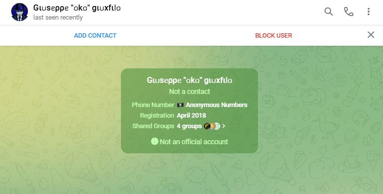
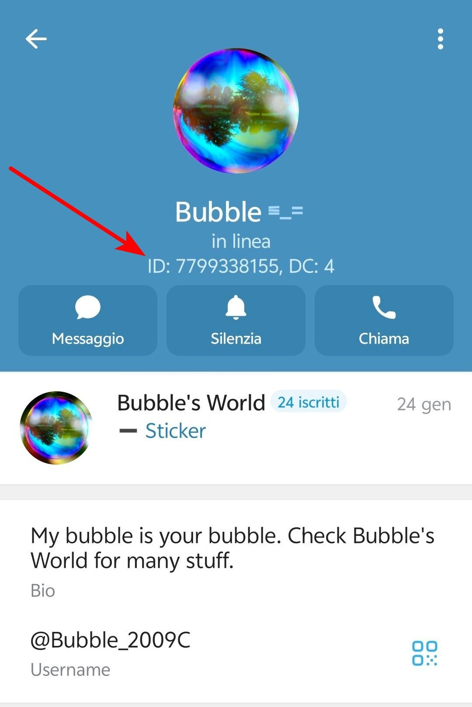
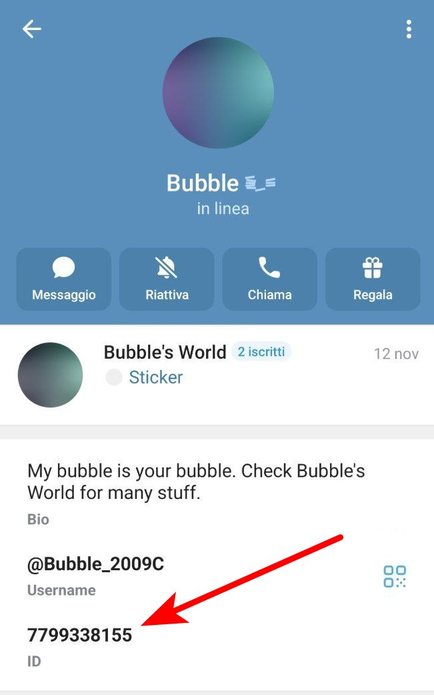
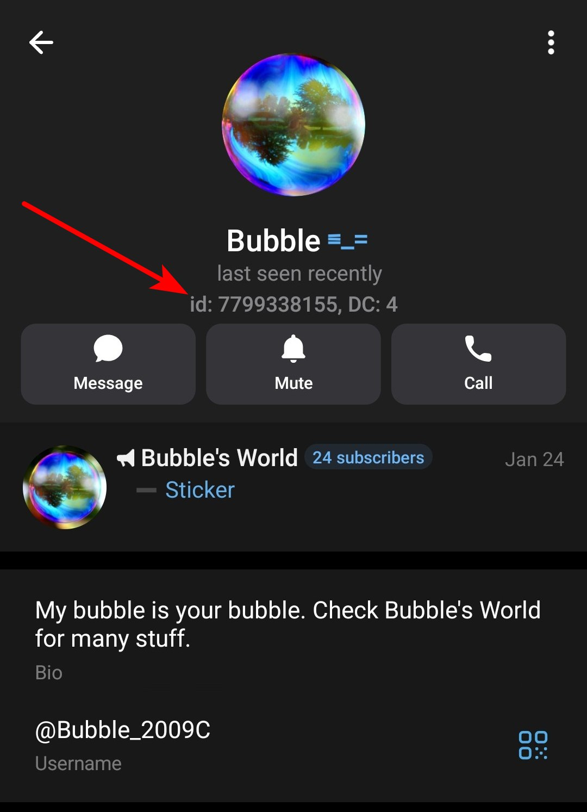
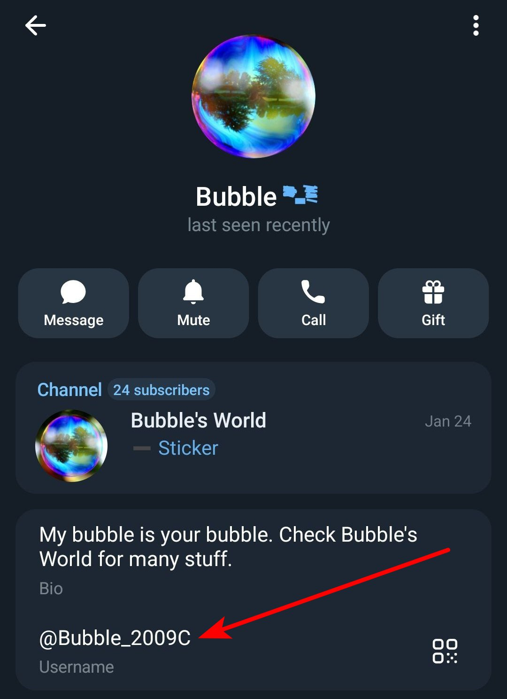
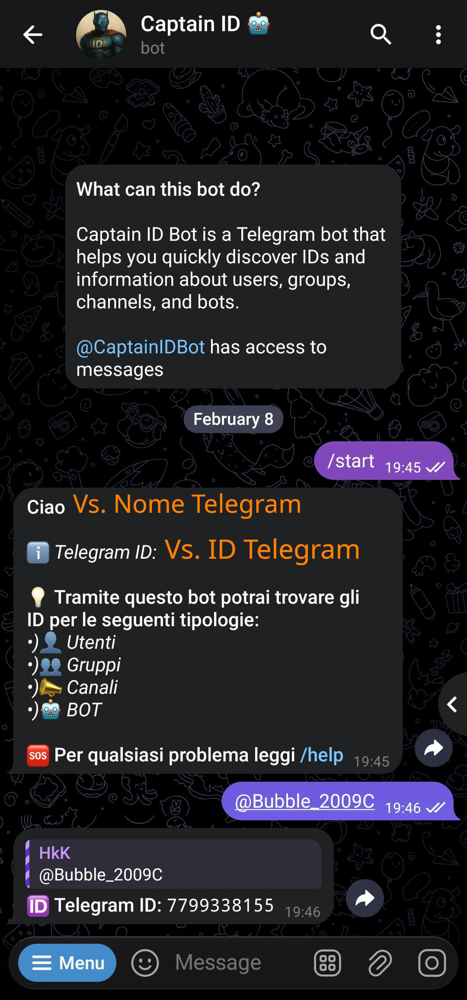
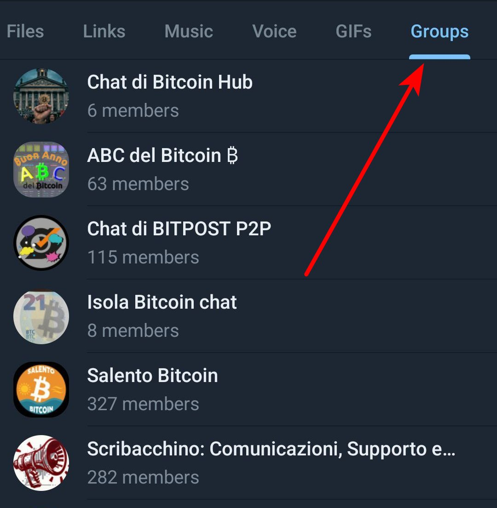

# Account Falsi, come difenderci.

Telegram è un sistema di messaggistica che si basa su un numero di Telefono. 
Questo vuol dire che per registrarvi, dovete inserire un numero di telefono valido. 
Il numero di telefono, però, non viene mostrato (sempre che abbiate regolato bene il livello della vostra privacy come visto in un altra guida) a meno che l'interlocutore non lo abbia già salvato nella sua rubrica oppure non siate voi a decidere di condividerlo.

Quello che voi vedrete di un account sarà principalmente un *Nome* ed una *Immagine*, questo, però, fa si che si possano creare due (o più) account *quasi identici*. 
Purtroppo, alcune entità malevoli, utilizzano questo escamotage per creare account che tentano di emularne altri. 
Inutile dire che chi crea questi account **lo fa solo e soltanto per scopi malevoli**; unicamente per cercare di sottrarvi qualcosa (soldi, dati personali, foto private o quant'altro).

Voglio però informarvi che **è possibile difendersi da questi attori malevoli**. 
Ora vi spiego come potete tutelarvi da questo tipo di truffa. 
Vedremo alcune tecniche utili a identificare i truffatori:

* [Primo contatto](#primo-contatto)
* [L'**username**](#lusername)
* [L'**ID**](#come-poter-visualizzare-lid-di-un-account-telegram-)
* [I gruppi](#gruppi-in-comune)
* [Segnalare gli impostori](#segnalare-gli-impostori)

Infatti su  Telegram esistono alcuni dati univoci che vi permettono di identificare con sicurezza un utente: l'**ID** e l'**username**. 
Questi due dati non sono assolutamente duplicabili e quindi possono essere utilizzati a nostro vantaggio. 
Vediamo come:

## Primo Contatto
Recentemente Telegram ha introdotto un sistema di notifica che appare quando un utente vi contatta per la prima volta. 
Questa prima schermata ci aiuta moltissimo a capire se ci sta contattando un utente reale oppure un attore malevolo che vuole truffarci. 
Vediamola insieme:

Notate che questa schermata appare solo la prima volta che un utente vi contatta ed oltretutto scompare dopo pochi giorni. 
Quindi, se avete dei dubbi, fatevi uno screenshot per poterlo consultare in seguito. 
Al centro di questa schermata, potete vedere alcune informazioni, tra cui la nazione del numero di telefono utilizzata per registrarsi, quando l'utente ha registrato l'account e, in questo caso, poco altro.

Vediamo un'altra schermata:

In questo schermata, oltre alle informazioni viste prima, possiamo anche vedere anche quanti gruppi in comunque abbiamo con questo utente. 
Questi dati ci permettono di avere una buona panoramica di chi ci sta contattando, ma, da questi, difficilmente potremo identificare con certezza un attore malevolo.  
Di seguito vedremo metodi più deterministici.

Alla fine di questa pagina, ho messo un link ad un'altra pagina in cui riporterò tutte le videate di scammer che troverò, sia di account clonati che di scammer puri. 
Se vi dovesse capitare e mi voleste condividere lo screenshot, mi dareste una grande mano ad arricchire questa guida.

Vediamo ora alcuni metodi deterministici:

## L'**username**
Penso che tutti (o quasi) abbiano sentito parlare dell'**username** utilizzato su Telegram. 
Alcuni gruppi, obbligano gli iscritti ad avere un **username** proprio perché, tramite questo, è possibile identificare in maniera univoca un utente.  
Per chi non sapesse come aggiungere l'**username** al proprio account può guardare questa altra guida. (*devo ancora scriverla, poi aggiungerò il link*) 
Se ancora non aveste importato un **username** al vostro account, vi consiglio di aggiungerlo.

Tramite l'**username** voi sarete in grado ci capire se un contatto che vi scrive è autentico o meno.
Vediamo come fare:

Andando a vedere il profilo dell'utente che vi scrive, vi apparirà una schermata simile:

Quella di sopra è la schermata del mio utente Telegram. 
La schermata è stata catturata usando la versione di Telegram ufficiale, scaricata dal Google Play Store. 
Come vedremo in seguito, esistono client alternativi a quello stock che integrano alcuni utili funzioni, ma per il momento, limitiamoci a Telegram stock. 
La maggior parte dei profili utente che vedrete, non avrà un canale personale nel profilo, quindi ignorate la parte relativa a :link:[Bubble's World](https://t.me/bubble2009world). 
Quello che ci interessa è la parte che segue. Nell'immagine potete vedere la **bio** e sotto ancora l'**username**.

Questo è l'**username** di cui parlavo prima. 
Questo dato è univoco, non troverete mai due utenti con lo stesso **username**, ma potreste trovarne di simili.

Uno scammer, infatti, potrebbe provare a falsificare l'**username** utilizzando caratteri simili. 
Vi faccio  un esempio: `Carlo` e `Car1o` possono sembrare molto simili, soprattutto se viene utilizzato un carattere più arrotondati (Carlo e Car1o). 
Allo stesso modo, sfruttando sempre il solito sfortunato utente, uno scammer, al posto di  `CARLO` potrebbe provare a scrivere `CARL0`. Nell'esempio è molto marcata la differenza, ma se togliessi questa formattazione, CARLO e CARL0 diventerebbero molto simili.

Quindi, confrontando l'**username** di chi vi ha contattato, con l'**username** del utente di cui siete sicuri dell'identità, potete scoprire se si tratta sicuramente di lui, oppure no, ma dovete fare molta attenzione ai caratteri visibilmente simili.

### Come trovare il vero **username** di un utente?
Dovete recuperare l'username dell'utente reale, per poterlo confrontare. 
Per questo scopo, andate a cercare un suo messaggio in una chat in cui lo avete visto scrivere, avendo la certezza che quel messaggio sia autentico. 
Possibilmente, cercate un messaggio anche datato, perché, il vostro ipotetico attaccante che ha creato l'account "**clone**" potrebbe aver iniziato ad usarlo in alcuni gruppi per cercare di mimetizzarsi. 
Sarebbero però, solo  messaggi recenti, perché, normalmente gli scammer hanno vita breve e i loro messaggi vengono segnalati e cancellati molto in fretta e gli utenti bannati.

Questo è già un metodo deterministico, ma c'è un altro modo per fare la medesima verifica utilizzando solo una stringa numerica, escludendo, quindi, il problema delle lettere simili. 
Vediamo come:

## L'**ID**
Ho gia detto che per potervi registrare a Telegram dovete inserire un numero di telefono, ma, **il vostro account**, in realtà, **non è il vostro numero di telefono!**. 
Telegram crea per ogni utente un **ID** univoco che inizialmente è legato al vostro numero di Telefono, ma in realtà, voi potete anche aggiornare il numero associato a questo **ID** senza che ques'ultimo vari.

### Come poter visualizzare l'**ID** di un account telegram ?
L'app ufficiale di Telegram, non visualizza l'**ID** degli utenti. 
Ci sono, però, tante altre app che, utilizzando le API di Telegram, offrono una esperienza utente migliore. 
Onestamente parlando, però, non so dirvi se queste app esistono anche dell'ecosistema della mela morsicata! 
Su Android, invece, ne esistono parecchie e molto valide, di seguito alcuni esempi (che aggiornerò nel tempo):

* :link:[Plus Messenger](https://play.google.com/store/apps/details?id=org.telegram.plus&hl=en-US)
    * secondo me uno dei migliore client Telegram mai esistiti, con solo due difetti:
        * non è open source
        * recentemente hanno introdotto delle pubblicità, 
        queste ultime, però, sono facilmente bypassabili con TOR o con un :link:[AdBlock Open Source](https://github.com/AdAway/AdAway);
* :link:[NekoGram](https://github.com/Nekogram/Nekogram)
    * OpenSource da PlayStore, ma vi suggerisco di scaricarlo dal loro canale Telegram:
        * :link:[Aggiornamenti](https://t.me/nekoupdates)
        * :link:[Download APK](https://t.me/NekoTestAPKs)
* :link:[ForkGram](https://github.com/forkgram/TelegramAndroid) aka `Fork Client` oppure anche `Telegram FOSS`
    * OpenSource, scaricabile da :link:[F-Droid](https://f-droid.org/packages/org.forkgram.messenger/);
    * Presenta pochissime differenze da quello "*ufficiale*" presente sul PlayStore
* *other coming soon*

Con queste App, andando sul profilo di un utente, oltre ai soliti dati, vedrete anche l'**ID**. 
Nei client alternativi che utilizzo, premendo sull'**ID**, questo viene copiato direttamente negli appunti.

    Nekogram:

***
    Mercurygram

***
    Forkgram

***
    Plus Messenger

***

L'**ID** è il sistema migliore per identificare un truffatore.

### Dovete usare Telegram Stock? Ecco come fare
Nel caso in cui, però, non abbiate la possibilità di installare un differente client Telegram (o perché avete un iPpone o per altri motivi) c'è comunque un modo per identificare l'**ID** di un utente.

Quella che segue è come vedete la normale videata di un contatto usando Telegram standard:

Precedentemente abbiamo visto cos'è l'**username**, ora lu useremo per identificare l'**ID** di un utente. 
Visto l'importanza dell'username, vi consiglierei di diffidare di chi contatta senza **username**. Nel caso in cui vi contattasse qualcuno senza **username**, potreste verificare se la persona **di cui sta tentando di copiare le sembianze** ha un **username**. De l'account autentico ne avesse uno, avreste l'immediata conferma *che vi ha contattato un account fake*.

Per identificare l'**ID** di un utente, vi consiglio di utilizzare il bot ***CaptainIDBot***. 
Esistono numerosi bot simili, ma vi suggerisco questo perché è stato programmato da un utente noto nella comunità: [*Gιᥙsᥱρρᥱ "ᥲkᥲ" gιᥙxfιᥣᥲ*](https://t.me/giuxfila).

Purtroppo ho fatto la triste scoperta che con Telegram standard, premendo sull'**username** questo non viene copiato negli appunti, come invece accade con client alternativi, pertanto dovete trascriverlo a mano.

Una volta trascritto, avviate il bot ***CaptainIDBot***. Potete farlo contattandolo tramite username: [@CaptainIDBot](https://t.me/CaptainIDBot) oppure tramite link: :link:[t.me/CaptainIDBot](https://t.me/CaptainIDBot).

La prima volta che Avviate il BOT, vi comparirà il Vs. nome Telegram ed il Vs. **ID** Telegram, ma a noi non interessa il nostro **ID**, ma quello dell'interlocutore, vediamo come recuperarlo.

Se scrivete nella chat con il BOT un username (nel mio caso @Bubble_2009C) il Bot vi restituirà il suo **ID** come in questo esempio:

Ora che in un modo o nell'altro abbiamo l'**ID** del nostro interlocutore, non ci resta che confrontarlo con l'**ID** dell'utente che sappiamo essere reale. 
Per cercare il messaggio dell'utente reale, utilizzate le stesse indicazioni date prima, prendere il suo **username** ed eseguire la stessa operazione con ***CaptainIDBot***.

Se i due **ID** corrispondono, allora potete avete la certezza che vi ha scritto lo stesso utente che ha scritto nel gruppo.

Per cercare un messaggio dell'utente "*originale*" potete consultare l'elenco dei gruppi che avete in comune:

## Gruppi in Comune
Sempre andando sui dettagli utente tramite Telegram, avete la possibilità di visionare i gruppi che avete in comune. 
Attenzione che se l'utente di cui state guardando il profilo, vi ha già condiviso dei media o ha pubblicato, dei post, per visualizzare i gruppi in comune, dovete scorrere fino in fondo.

A cosa vi serve saperlo? 
Vi faccio un esempio pratico: siete nel gruppo ***PIPPO*** e dopo una vostra domanda vi scrive uno dicendovi una cosa del tipo: 
        "*Sono UGO del supporto tecnico di PIPPO, mi è stato affidato il tuo caso*"
Un messaggio del genere è **SCAM al 99,9%**, ma potete comunque controllare i gruppi che avete in comune. 
Se è un utente **SCAM**, non lo troverete nel gruppo *PIPPO*, quindi bloccatelo e segnalatelo immediatamente.

Guadare i gruppi che avete in comune, è un indice della veridicità del contatto, ma non una prova certa. 
Non basatevi solo su questa prova per controllare la veridicità di un account che vi contatta.

## Segnalare gli impostori
Telegram mette a disposizione un bot ufficiale per segnalare gli account degli impostori. 
Segnalare questi scammer è **un dovere per la comunità**.

Vi esorto, pertanto, a segnalare eventuali impostori utilizzando il bot :link:[NoToScam](https://t.me/notoscam)

## Esempi di Scammer
Come annunciato, ho creato una pagina in cui riporto le videate degli scammer che riesco a recuperare, di ognuna vi indicherò le incongruenze a cui dovete stare attenti. 
:link:[Gli SCAMMER](Scammer_it.md)

***
[Qui per tornare all'elenco delle guide.](../README.md)
| | |
| :------- | :--------: |
|  Come sempre invito chiunque voglia commentare a farlo liberamente, accetto volentieri C&C che possano arricchire e/o correggere questo scritto. Ho buttato tutto giù di getto, pertanto segnalatemi anche qualsiasi tipo di errore.   Per parlare con me di questa guida, unitevi al :link:[Gruppo Telegram ABC dl Bitcoin](https://t.me/+GlEaD0WD53BmNGE0).|  |
