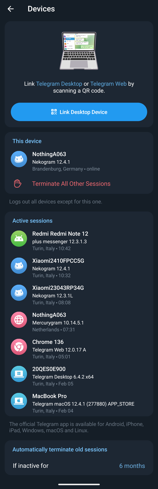
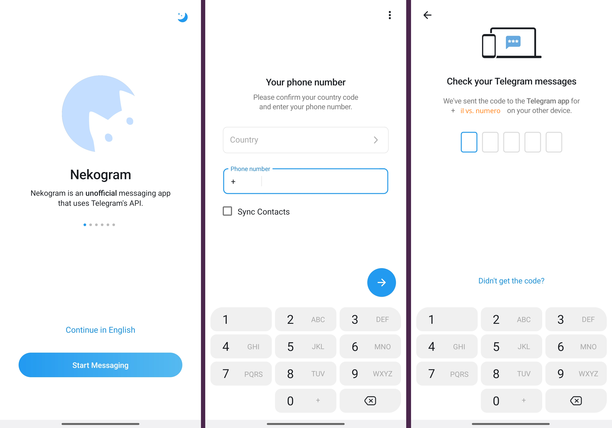
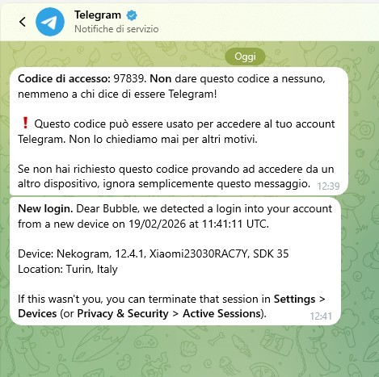
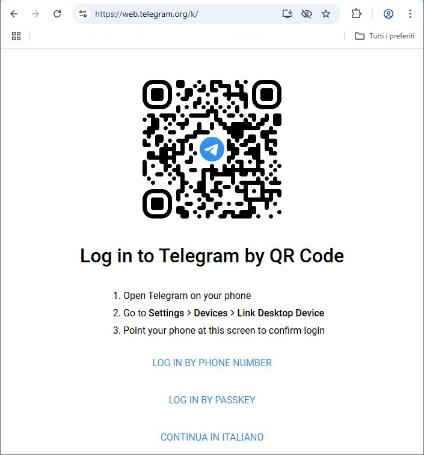
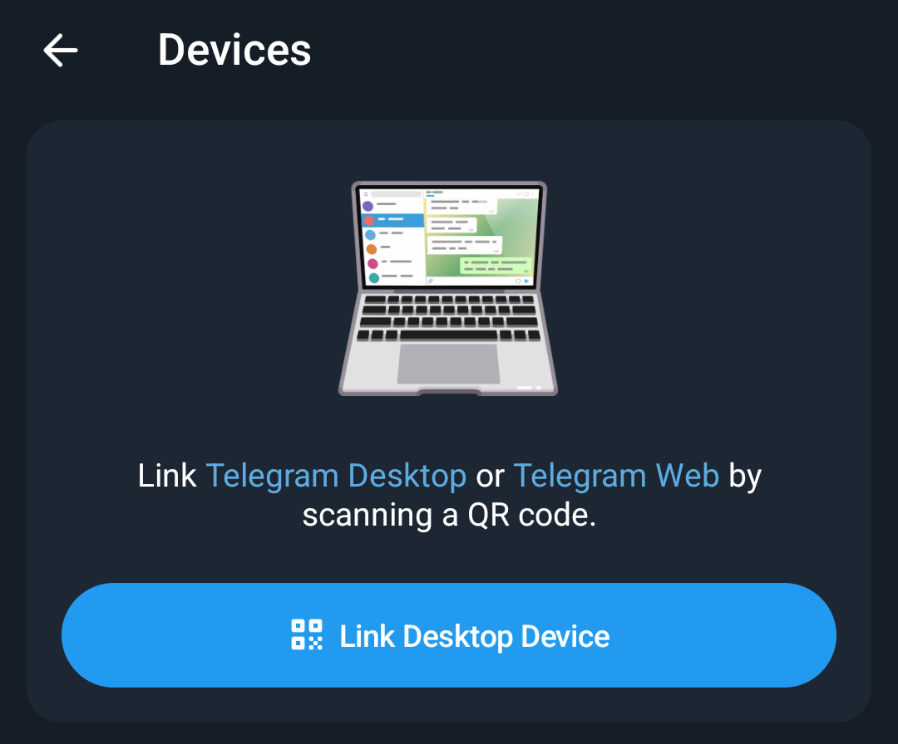
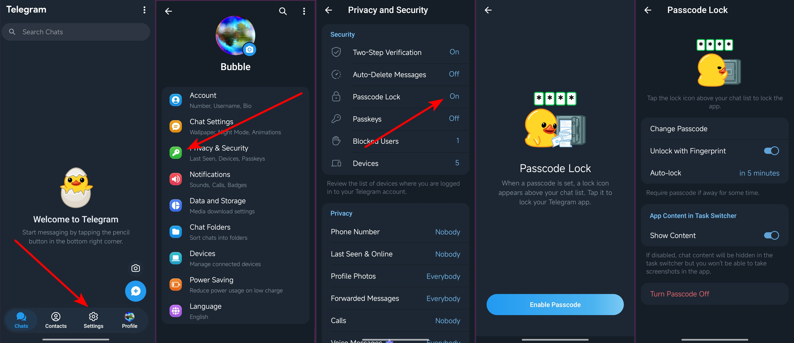

# Prevenire il furto dell'account

In questa guida vedremo come mettere in sicurezza il vostro account Telegram.

## Intro

Telegram, a differenza di WhatsApp, può essere installato su più dispositivi contemporaneamente. 
I dispositivi aggiuntivi, non sono solo computer con applicazioni Web o Desktop, ma anche Telefoni e Tablet. 
Uno stesso account può essere presente su svariati dispositivi contemporaneamente senza nemmeno mai richiedere la una conferma di riattivazione.

E' però possibile inserire un logout automatico dopo un determinato lasso di tempo dall'ultimo login. 
Come vedete nell'esempio sopra, è stato impostato 6 mesi, dopo di che il sistema disconnetterà quel device.

## Come si effettua un secondo login

E' bene vedere come funziona il login su un secondo device, per capire cosa deve fare un ladro per accedere al vostro account. 
Dipendentemente dal dispositivo su cui fare il login, ci sarà una procedura differente.

### Login su un altro dispositivo mobile (Smartphone o Tablet)

Per fare il login su un altro dispositivo mobile, dovete innanzitutto installare Telegram (o un suo fork) sul vostro dispositivo. 
Una volta installato, vi verrà chiesto di inserire il numero di telefono ed in seguito, verrà inviato un codice su un altro vostro dispositivo su cui è presente quell'account.

Quì vediamo come avvengono i passaggi utilizzando Nekogram.

Si vostri altri dispositivi su cui è presente quel profilo Telegram, arriverà un messaggio proprio da Telegram, contenente il codice da inserire per poter autorizzare il nuovo device.

ATTENZIONE! Questo messaggio che riceverete, è un messaggio particolare.
Innanzitutto nell'anteprima, il numero verrà censurato e dovrete entrare nella chat stessa per poterlo leggere. 
In più, questo messaggio potrebbe non essere il primo della lista, infatti mi capita spesso di dover scorrere in basso per trovarlo.

Già nel messaggio che ci invia telegram, ci avvisa che potrebbe essere qualcun altro ad aver richiesto questo codice. 
Ma questo lo vedremo meglio dopo.

Una volta che avete attivato con quel codice il novo dispositivo, Telegram, nella stessa chat di prima, vi invierà un avviso inerente a questo nuovo login.

Questo messaggio arriverà su tutti i dispositivi su cui avete questo account, ma continua ad essere un messaggio speciale. 
Ammettiamo che voi abbiate un iPhone ed un Android ed ora state collegando un Tablet leggendo il messaggio sul vostro iPhone, anche se cancellate questo messaggio sul melafonino, quando prenderete in mano il device Android, lo ritroverete ancora presente e da leggere.

### Login su computer (Telegram WEB o Telegram Desktop)
Se vi volete connettere il vostro account Telegram al vostro computer, dovete innanzitutto prepararlo eseguendo una delle due seguenti operazioni:

1. Andare sul sito :link:[Telegram WEB](https://web.telegram.org/k/);
2. scaricare l'applicazione :link[Telegram Desktop](https://desktop.telegram.org/web) disponibile per Windows, Linux e macOS.
    * su :link:[GitHub](https://github.com/telegramdesktop/tdesktop), però trovate anche altre versioni, ad esempio:
        * versione GNU/Linux compilabile  (senza dover infettare il sistema con Snap o Flatpak)
        * :link[Unigram](https://github.com/UnigramDev/Unigram), un'altra versione FOSS di Telegram per Windows 
        (scaricatela da GitHub, non dal Microsoft Store)

Una volta eseguita questa operazione, il vostro computer vi mostrerà un QR code che dovrete inquadrare tramite l'applicazione Telegram che avete sul device mobile per poter accedere:

Per accedere con il QR code, dovete avviare Telegram sul vostro dispositivo mobile ad andare su `Setting :arrow_right: Devices` e vi si aprirà la videata che avete visto sopra di cui riporto quì il dettaglio che ci interessa:

Premendo quel pulsantone, si aprirà la fotocamera ed inquadrando quel QR code, avrete replicato il login sul computer.

Come potete vedere, sotto al QR code, ci sono altri due metodi di login:
1. login con il numero di telefono;
2. login con passkey.

Del login con passkey, ne parleremo in seguito, del login con numero di telefono, ne ho parlato nel blocco precedente.

Non appena avrete fatto questo login, Telegram vi invierà invierà il messaggio di notifica come visto sopra, con le stesse modalità se avete più di un device collegato.

## Come Tutelarvi

Ho voluto farvi vedere come si può fare il login su un device secondario per farvi comprendere una cosa fondamentale:

    Per poter fare un secondo accesso al vostro account, è necessario il vostro account principale.

Quindi, tenendo al sicuro il vostro dispositivo, non dovreste correre alcun rischio, ma vediamo ora come tenerlo al sicuro.

La messa in sicurezza del vostro account Telegram passa per tre punti:
1. [proteggere il telefono](#proteggere-il-telefono);
2. [proteggere l'accesso a Telegram](#proteggere-laccesso-a-telegram);
3. [proteggere il login su un secondo device](#proteggere-il-login-su-un-secondo-device).

Vediamo punto per punto il ***come** ed il **perchè***:

### Proteggere il telefono
Perchè è importante proteggere il telefono? 
Magari voi state pensando ad un furto di account da parte di un attore malevolo remoto, ma dobbiamo anche tutelarci da un eventuale attacco "fisico" al nostro account.

Lasciare il telefono incustodito e non protetto, può comportare il furto di numerosi dati, tra cui anche il vostro account Telegram, pertanto:

    Bisogna sempre proteggere il telefono con una adeguata protezione, in ordine di sicurezza, possiamo trovare i seguenti metodi:

     * Password o passphrase
     * Codice pin numerico
     * Impronta digitale
     * Pattern grafico
     * Sblocco con face id

Oltre al telefono, va protetta anche la sim card con il pin. 
Questo perchè, con qualche escamotage, è possibile attivare una seconda utenza di Telegram anche con un codice SMS, pertanto una attore malevolo potrebbe anche estrarre la vostra sim non protetta, inserirla in un altro telefono, ricevere il messaggio di conferma e poi reinserire la sim nel vostro telefono.

    Attenzione, questa è una precauzione importante anche per tutti quei 2FA che vi inviano un sms.

Quindi, applicate una protezione **sia al vostro telefono che alla vostra sim** prima di passare al punto successivo.

### Proteggere l'accesso a Telegram
Molti telefoni prevedono un sistema per il blocco delle app, ma Telegram stesso ha questa feature ed è di questa che ora vi parlerò.

Visto che per attivare un secondo accesso è necessario operare con il vostro account, è necessario proteggerlo adeguatamente.

Per abilitare il blocco nativo di Telegram è sufficiente andare in `Setting :arrow_right: Privacy & Security :arrow_right: Passcode Lock` 
Vi verrà chiesto di creare un codice di 4 cifre che servirà a sbloccare il vostro Telegram.

Nell'immagine sopra potete vedere tutti i passaggi necessari ad impostare il codice di blocco. 
Dopo aver creato il codice sarà anche possibile impostare i seguenti parametri:
1. sblocco con il sistema biometrico;
2. lasso di tempo dopo il quale far intervenire il blocco;
3. se sfocare il contenuto di Telegram durante il passaggio tra un0app e l'latra.

Lascio a voi decidere come impostare questi parametri, ricordando che lo sblocco biometrico è comunque meno sicuro del codice pin.

Ora che il Telefono e Telegram sono adeguatamente protetti, andiamo ad analizzare l'ultimo passaggio.

### proteggere il login su un secondo device

Ora andiamo ad attivare l'autenticazione a due fattori su Telegram. 
Una delle ultime persone a cui ho fatto fare questo passaggio, mi ha detto che odiava il 2FA perchè richiede lunghe attese per poter fare il login.

Non temete. 
Non è il nostro caso. 
Telegram richiede il 2FA solamente in caso di nuovo login.

