# Prevenire il furto dell'account

In questa guida vedremo come mettere in sicurezza il vostro account Telegram.

* [Introduzione](#intro) e panoramica di Telegram;
* Come effettuare [un secondo login](#come-si-effettua-un-secondo-login) con la vostra utenza Telegram;
    * su un [dispositivo mobile](#login-su-un-altro-dispositivo-mobile-smartphone-o-tablet) secondario;
    * su [un computer](#login-su-computer-telegram-web-o-telegram-desktop) tramite weo o client desktop;
    * consigli sulla [gestione di login secondari](#alcuni-consigli-per-la-gestione-dei-login-secondari);
    * gli [avvisi](#come-telegram-ci-avvisa-di-un-secondo-login) che vi informano di un secondo login.
* [Mettere in sicurezza il vostro account](#come-tutelarvi)
    * proteggere [il telefono](#proteggere-il-telefono);
    * proteggere [l'accesso a Telegram](#proteggere-laccesso-a-telegram);
    * proteggere [il login su un secondo device](#proteggere-il-login-su-un-secondo-device).
* [Altre impostazioni](#altre-impostazioni-di-sicurezza)

***
## Intro

Telegram, a differenza di WhatsApp, può essere installato su più dispositivi mobili contemporaneamente. 
(WhatsApp può essere usato su telefono e computer, ma non su due telefoni) 
I dispositivi aggiuntivi, non sono solo computer con applicazioni Web o Desktop, ma anche Telefoni e Tablet. 
Uno stesso account può essere presente su svariati dispositivi contemporaneamente senza nemmeno mai richiedere la una conferma di riattivazione.

E' però possibile inserire un logout automatico dopo un determinato lasso di tempo dall'ultimo login. 
Come vedete nell'esempio sopra, è stato impostato 6 mesi, dopo di che il sistema disconnetterà quel device.

***

## Come si effettua un secondo login

E' bene vedere come funziona il login su un secondo device, per capire cosa deve fare un ladro per accedere al vostro account. 
Dipendentemente dal dispositivo su cui fare il login, ci sarà una procedura differente.

### Login su un altro dispositivo mobile (Smartphone o Tablet)

Per fare il login su un altro dispositivo mobile, dovete innanzitutto installare Telegram (o un suo fork) sul vostro dispositivo. 
Una volta installato, vi verrà chiesto di inserire il numero di telefono ed in seguito, verrà inviato un codice su un altro vostro dispositivo su cui è presente quell'account.

Quì vediamo come avvengono i passaggi utilizzando Nekogram.

Sui vostri altri dispositivi su cui è presente quel profilo Telegram, arriverà un messaggio proveniente proprio da **Telegram**, contenente il codice da inserire per poter autorizzare il nuovo device.

    ATTENZIONE! Questo messaggio che riceverete, è un messaggio particolare:
    
    1) nell'anteprima, il numero verrà censurato e dovrete entrare nella chat stessa per poterlo leggere;
    2) questo messaggio potrebbe non essere il primo della lista, infatti mi capita spesso di dover scorrere in basso per trovarlo.

Già nel messaggio che ci invia telegram, ci avvisa che potrebbe essere qualcun altro ad aver richiesto questo codice. 
Ma questo lo vedremo meglio dopo.

Una volta che avete attivato con quel codice il novo dispositivo, Telegram, nella stessa chat di prima, vi invierà un avviso inerente a questo nuovo login.

Questo messaggio arriverà su tutti i dispositivi su cui avete questo account, con le stesse caratteristiche del messaggio speciale viste prima. 
Ammettiamo che voi abbiate un iPhone ed un Android ed ora state collegando un Tablet leggendo il messaggio sul vostro iPhone, anche se cancellate questo messaggio sul melafonino, quando prenderete in mano il device Android, lo ritroverete ancora presente e da leggere.

In seguito vedremo come aggiungere ulteriore sicurezza con il 2FA.

### Login su computer (Telegram WEB o Telegram Desktop)
Se vi volete connettere il vostro account Telegram al vostro computer, dovete innanzitutto prepararlo eseguendo una delle due seguenti operazioni:

1. Andare sul sito :link:[Telegram WEB](https://web.telegram.org/k/);
2. scaricare l'applicazione :link:[Telegram Desktop](https://desktop.telegram.org/web) disponibile per Windows, Linux e macOS.
    * su :link:[GitHub](https://github.com/telegramdesktop/tdesktop), però trovate anche altre versioni, ad esempio:
        * versione GNU/Linux compilabile  (senza dover infettare il sistema con Snap o Flatpak)
        * :link:[Unigram](https://github.com/UnigramDev/Unigram), un'altra versione FOSS di Telegram per Windows 
        (scaricatela da GitHub, non dal Microsoft Store)

Una volta eseguita questa operazione, il vostro computer vi mostrerà un QR code che dovrete inquadrare tramite l'applicazione Telegram che avete sul device mobile per poter accedere:

Per accedere con il QR code, dovete avviare Telegram sul vostro dispositivo mobile ad andare su *Setting :arrow_right: Devices* e vi si aprirà la videata dei Device vista visto sopra di cui riporto quì il dettaglio che ci interessa:

Premendo quel pulsantone, si aprirà la fotocamera ed inquadrando quel QR code, avrete evvettuato il login sul computer.

Come potete vedere, sotto al QR code, ci sono altri due metodi di login:
1. login con il numero di telefono;
2. login con passkey.

Del login con passkey ne parleremo in seguito, del login con numero di telefono ne ho parlato nella sezione precedente.

Non appena avrete effettuato il login, Telegram vi invierà il messaggio di notifica come visto sopra, su tutti i device.

### Alcuni consigli per la gestione dei login secondari

Telegram ci permette di impostare alcune limitazioni sui login secondari. 
Sono solo due opzioni, mac che vi suggerisco vivamente di impostare se decidete di gestire il vostro account su più dispositivi:
* Ricezione chiamate
* Chat segrete

Vediamole nel dettaglio:

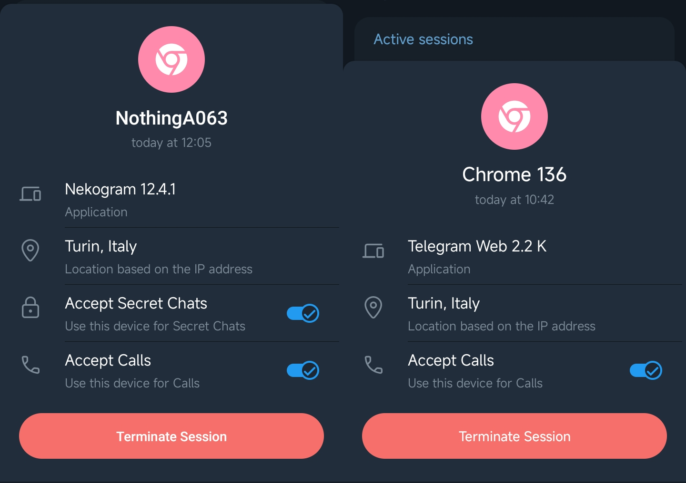

    Chiamate

Ammesso che vogliate ricevere chiamate tramite Telegram, vi suggerisco di decidere su quale device le volete ricevere, per evitare che squillino tutti contemporaneamente o che vi squilli un computer su cui non avete casse o microfono.

    Chat Segrete

Le chat segrete, quelle con crittografia end-to-end, possono essere aperte su un unico dispositivo, ma non in istanze web. 
Per evitare di dover andare a cercare su molteplici dispositivi una chat segreta, vi suggerisco vivamente di eleggere il dispositivo più sicuro, come unico dispositivo che può accettare **chat segrete**.

    A proposito i login da browser WEB

Se avete impostato che il vostro browser cancelli i cookie ad ogni avvio, dovrete ripetere ogni volta il login con QR code (come visto sopra), su Telegram, però, la sessione risulterà ancora attiva. 
Il mio consiglio, prima di eccettuare un nuovo login web, è quello di terminare il precedente dall'elenco dei device autorizzati.

### Come Telegram ci avvisa di un secondo login

Abbiamo già visto i messaggi che Telegram invia in chat privata in caso di un secondo login, ma se doveste perdervi questi, al successivo login sul vecchio device su cui avete installato Telegram, vi troverete davanti ad un messaggio similare:

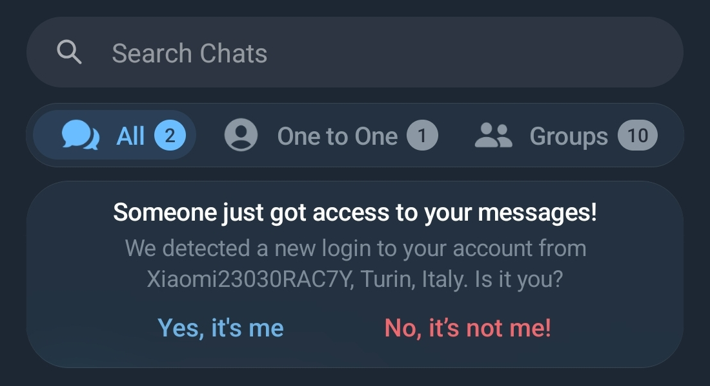

Questo avviso chiaro e lampante dovrebbe metterci in immediato allarme nel caso che un attore malevolo abbia avuto accesso al vostro account. 
Nel caso non riconosceste questo login secondario, con la pressione della scritta **No, it's not me!** potete terminare immediatamente la sezione secondaria.

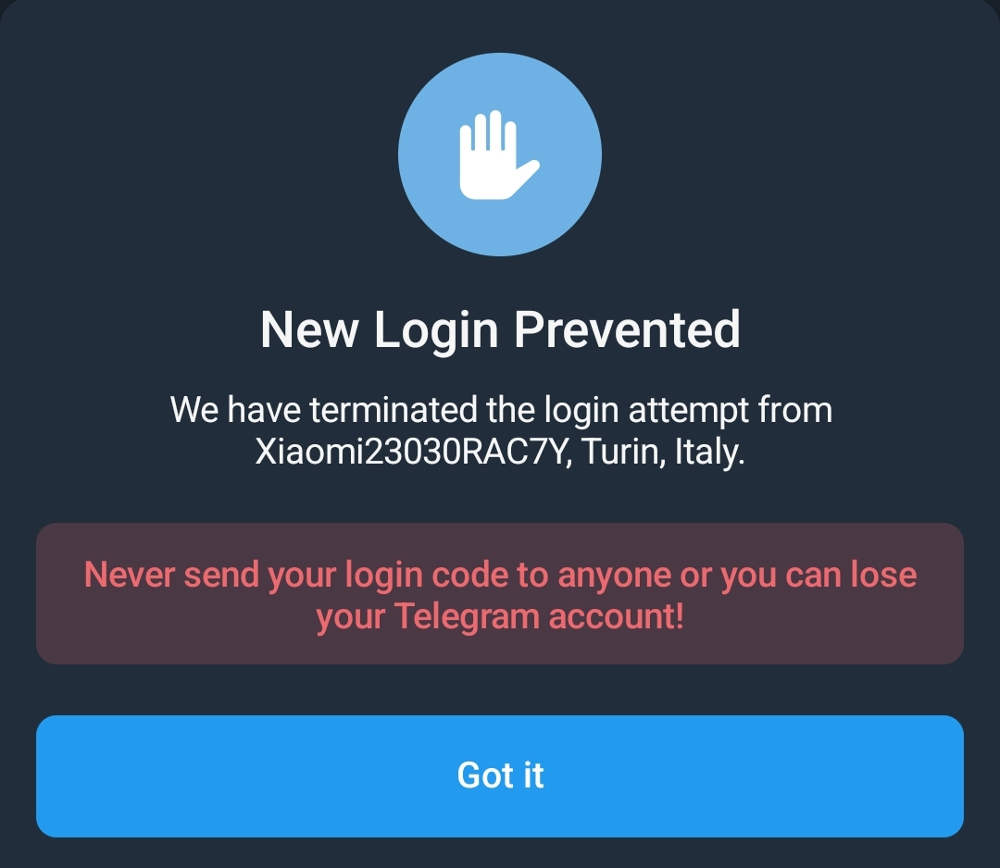

***

## Come Tutelarvi

Ho voluto farvi vedere come si può effettuare il login su un device secondario per farvi comprendere che:

    Per poter fare un secondo accesso al vostro account, è necessario il vostro account principale.

Quindi, tenere al sicuro il vostro dispositivo, è una cosa fondamentale per prevenire che un attore malevolo locale possa clonarvi l'account. 
Vediamo quindi i passi base per mettervi in sicurezza.

La messa in sicurezza del vostro account Telegram passa per tre punti:
1. proteggere [il telefono](#proteggere-il-telefono);
2. proteggere [l'accesso a Telegram](#proteggere-laccesso-a-telegram);
3. proteggere [il login su un secondo device](#proteggere-il-login-su-un-secondo-device).

Vediamo punto per punto il ***come** ed il **perchè***:

### Proteggere il telefono
Perchè è importante proteggere il telefono? 
Magari voi state pensando unicamente ad un furto di account da parte di un attore malevolo remoto, ma dobbiamo anche tutelarci da un eventuale attacco "fisico" al nostro account.

Lasciare il telefono incustodito e non protetto, può comportare il furto di numerosi dati, tra cui anche il vostro account Telegram, pertanto:

    Bisogna sempre proteggere il telefono con una adeguata protezione,
    in ordine di sicurezza, possiamo trovare i seguenti metodi:

     * Password o passphrase
     * Codice pin numerico
     * Impronta digitale
     * Pattern grafico
     * Sblocco con face id

Oltre al telefono, va protetta anche la sim card con il pin. 
Questo perchè, con qualche escamotage, è possibile attivare una seconda utenza di Telegram anche con un 2FA tramite codice SMS.
Un attore malevolo, quindi,  potrebbe anche estrarre la vostra sim non protetta, inserirla in un altro telefono, ricevere il messaggio di conferma e poi reinserire la sim nel vostro telefono.

    Attenzione, questa è una precauzione importante anche per tutti quei 2FA che vi inviano un sms.

Applicate una protezione **sia al vostro telefono che alla vostra sim** prima di passare al punto successivo.

### Proteggere l'accesso a Telegram
Molti telefoni prevedono un sistema per il blocco delle app, ma Telegram stesso ha un sistema di protezione ed è di questa che ora vi parlerò.

Visto che per attivare un secondo accesso è necessario operare con il vostro account, è necessario che la vostra istanza Telegram sia adeguatamente protetta.

Per abilitare il blocco nativo di Telegram è sufficiente andare in *Setting :arrow_right: Privacy & Security :arrow_right: Passcode Lock* 
Vi verrà chiesto di creare un codice di 4 cifre che servirà a sbloccare il vostro Telegram.

Nell'immagine sopra potete vedere tutti i passaggi necessari ad impostare il codice di blocco. 
Dopo aver creato il codice sarà anche possibile impostare i seguenti parametri:
1. sblocco con il sistema biometrico;
2. lasso di tempo dopo il quale far intervenire il blocco;
3. se sfocare il contenuto di Telegram durante il passaggio tra un'app e l'altra.

Lascio a voi decidere come impostare questi parametri, ricordando che lo sblocco biometrico è comunque meno sicuro del codice pin.

Ora che il Telefono e Telegram sono adeguatamente protetti, andiamo ad analizzare l'ultimo passaggio.

### proteggere il login su un secondo device

Andiamo ora ad attivare l'autenticazione a due fattori su Telegram. 
Una delle ultime persone a cui ho fatto fare questo passaggio, ha affermato che "*odiava il 2FA perchè richiede lunghe tempistiche per l'accesso*.

Non temete. 
Non è il nostro caso. 
Telegram richiede il 2FA solamente in caso di nuovo login.

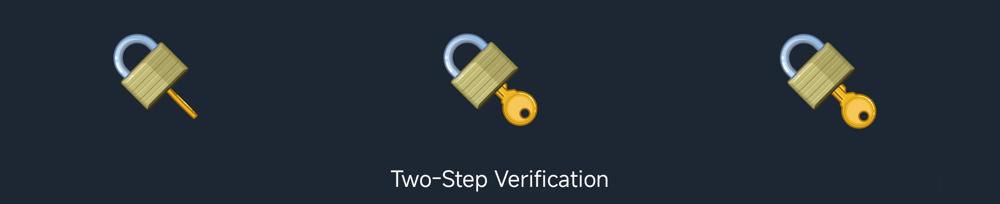

Per abilitare il 2FA, dove seguire questa procedura:

*Setting :arrow_right: Privacy & Security :arrow_right: Two Step Verification*

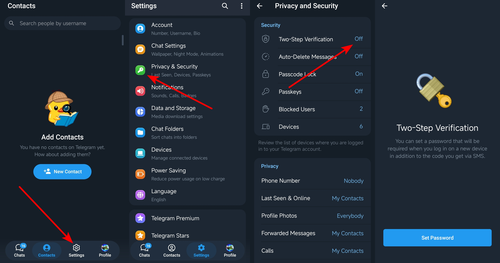

Proseguendo, vi verranno chiesti questi dati:

* Una Password;
* Un suggerimento password (*facoltativo*);
* Una email di recovery.

Alcune note su questi dati che vi vengono richiesti:
* **Password**
    * Questa password vi servirà quando dovrete effettuare un secondo login, potete anche generarne una casuale e tenerla al sicuro in un gestore di password dato supongo che questa sarà una operazione che non effettuerete spesso;
* **email**
    * per garantire l'efficacia del 2FA, questa mail non dovrebbe essere facilmente reperibile dal vostro telefono, altrimenti, un attore malevolo, impadronitosi di un vostro telefono, avrebbe tutti i mezzi per rubarvi l'account

Di seguito potrete vedere i passaggi da effettuare:

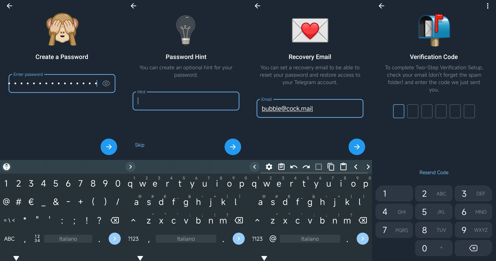

Come potete vedere, vi viene chiesto di confermare l'operazione con un codice che vi arriverà per mail. 
Una volta confermato questo codice, finalmente il vostro account sarà protetto con l'autenticazione a due fattori.

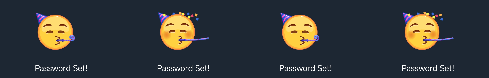

***
Ora che il 2FA è attivo, quando effettuerete il login su un dispositivo secondario, vi verrà richiesto di inserire la password che avete impostato.

***

## Altre impostazioni di sicurezza
Concludo con un accenno a questi altri metodi di tutela della privacy e sicurezza che vi mette a disposizione Telegram.

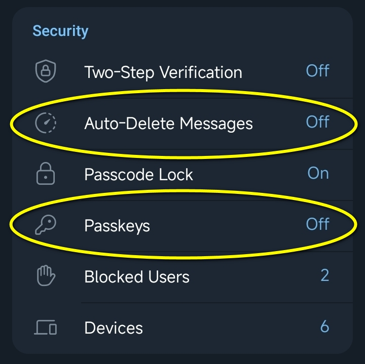

Iniziamo da questa semplici impostazione di privacy:

### Auto cancellazione messaggi

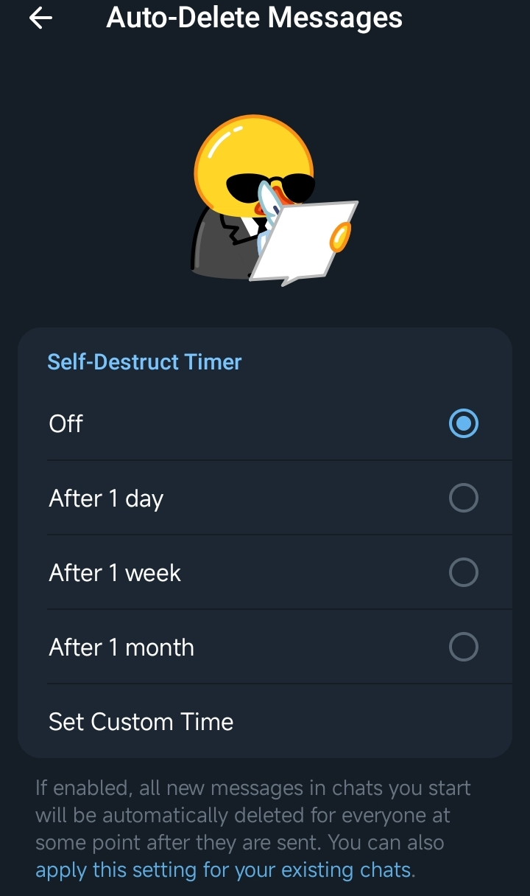

Potete impostare un timer di auto cancellazione che avrà effetto su tutte le nuove chat che inizierete. 
Potete anche attivarlo in maniera retroattiva.

### Passkey
La Passkey di Telegram, mi piace poco, ma per completezza ne faccio un accenno.

Ecco due cose poco piacevoli sulla Passkey di Telegram:
* Attualmente è gestita dalla versione stock di Telegram e da pochissimi client alternativi;
* Telegram, per il momento, pare si possa interfacciare solo con le app di gestione password di **iCloud** e di **Google**.

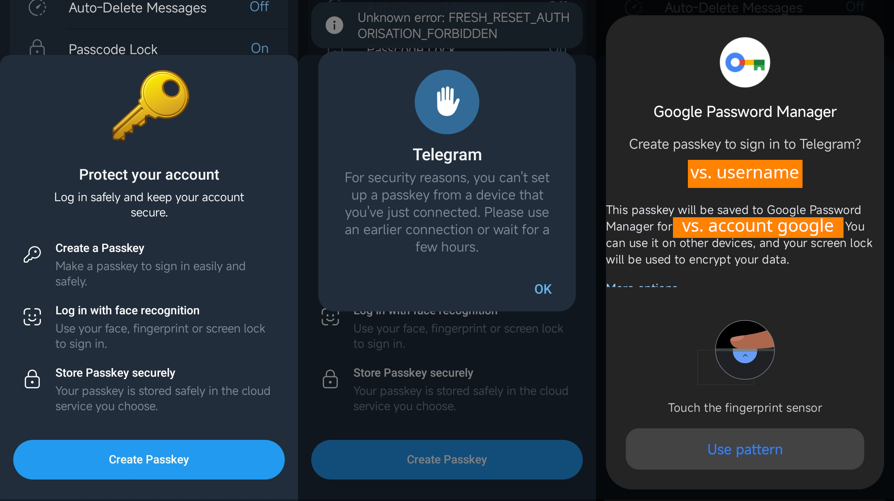

A comprova di questo, un telefono Android **con google integrato**, vi propone di usare **Google Password Manager** come gestore della vostra Passkey. 
Oltre alla mia innata repulsione per queste big tech, con questo tipo di protezione, torneremmo al singolo punto di fallimento visto che avremmo sullo stesso device sia l'account Telegram che il nostro gestore di Passkey.

Per questo motivo ATTUALMENTE, NON USO PASSKEY!

### Varie ed eventuali

Questi accorgimenti di sicurezza che abbiamo visto fino ad ora, dovrebbero tutelarvi dal furto dell'account. 
In ogni caso, se un attore malevolo dovesse riuscire ad effettuare un login nel vostro account, non sarebbe in modo di applicare queste impostazioni di sicurezza. 
Telegram impedisce di attivare sia il 2FA che la passkey su un account appena creato.

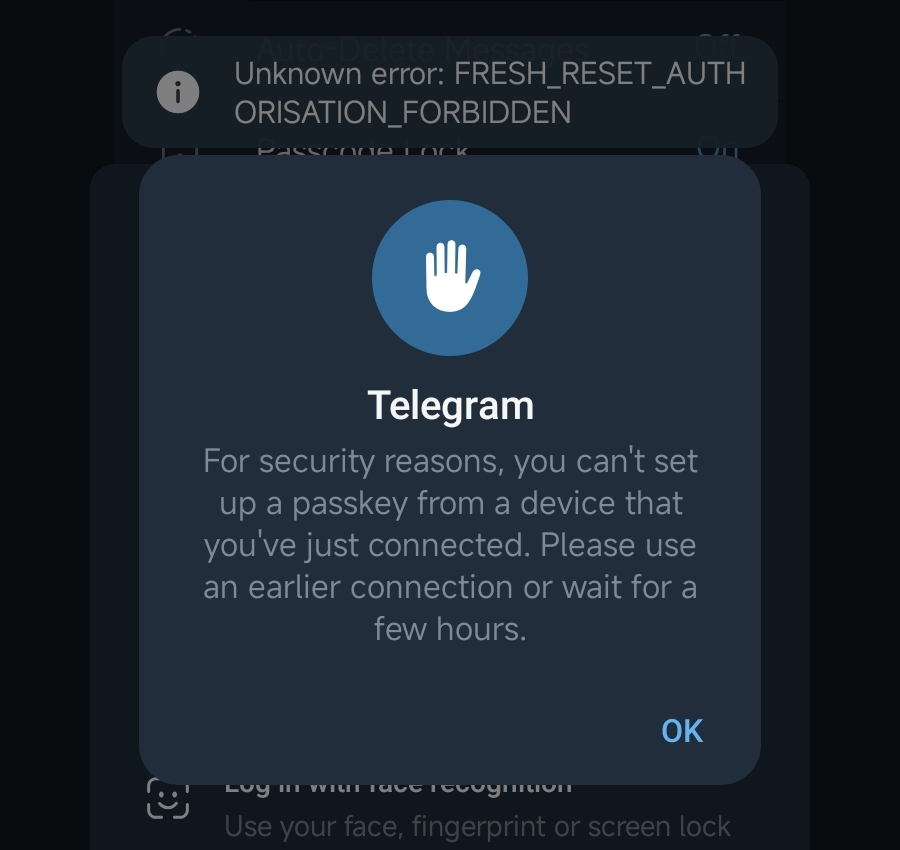

Questo, significa, che anche se il vostro account se il vostro account venisse compromesso, potreste comunque provvedere a riprenderne il possesso agendo tempestivamente. 
Se vi dovesse capitare, **contattatemi e vi aiuterò a riprenderne il controllo**.

*** 

Se avete seguito i consigli di questa guida, il vostro telefono ed il vostro account Telegram, dovrebbero essere debitamente tutelati.

***
:link:[Qui per tornare all'elenco delle guide.](../README.md)
| | |
| :------- | :--------: |
|  Come sempre invito chiunque voglia commentare a farlo liberamente, accetto volentieri C&C che possano arricchire e/o correggere questo scritto. Ho buttato tutto giù di getto, pertanto segnalatemi anche qualsiasi tipo di errore.   Per parlare con me di questa guida, unitevi al Gruppo Telegram :link:[ABC del Bitcoin](https://t.me/+GlEaD0WD53BmNGE0).|  |
