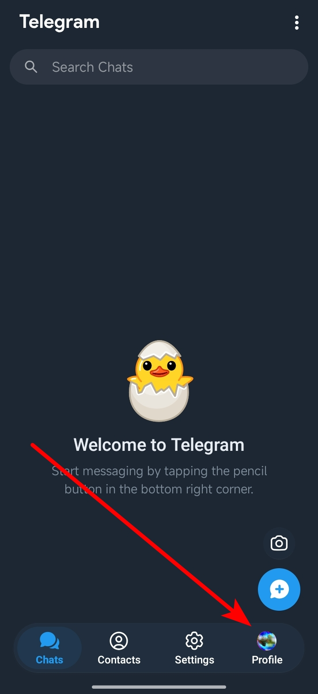
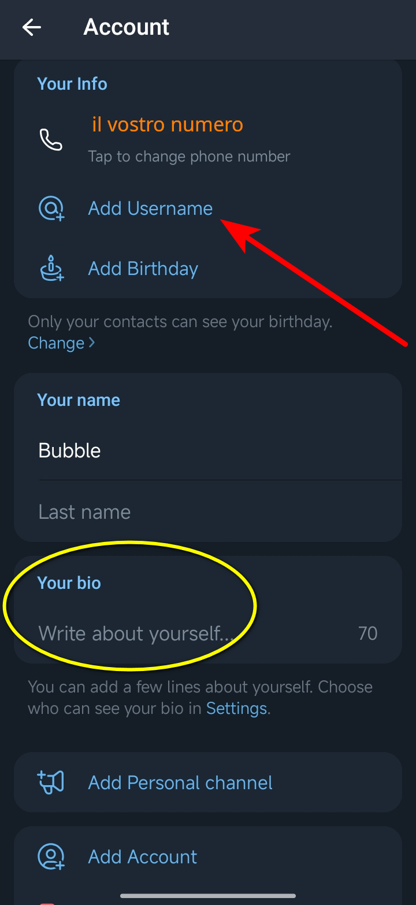
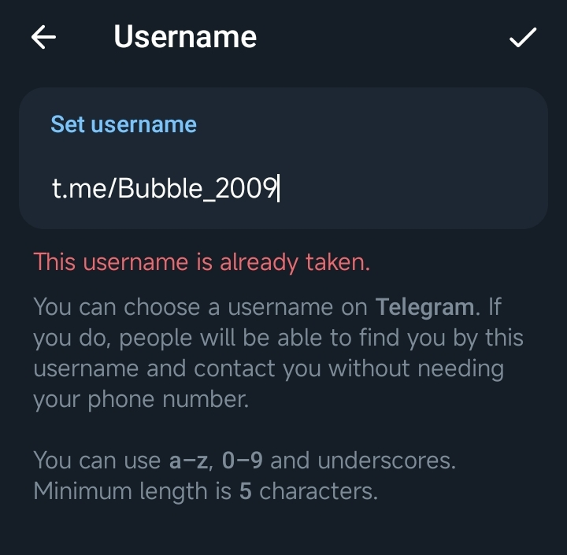

# Creare, gestire e utilizzare un **Username**.

Di seguito vedremo alcune cose a proposito dell'**username**:
1. [Perchè è importante un username?](#introduzione)
2. [Aggiungere un username](#aggiungere-un-username)

## Introduzione
Telegram è un sistema di messaggistica che si basa su un numero di Telefono. 
Questo vuol dire che per registrarvi, dovete inserire un numero di telefono valido. 
Il numero di telefono, però, non viene mostrato (sempre che abbiate regolato bene il livello della vostra privacy come visto in un altra guida) a meno che l'interlocutore non lo abbia già salvato nella sua rubrica oppure non siate voi a decidere di condividerlo.

Il numero di telefono utilizzato per la registrazione, però, **non è il vostro account**, perchè voi potete anche aggiornare il numero associato a questo account Telegram, senza compromettere l'account.

Appena vi registrate, al vostro account viene assegnato un **ID** numerico univoco. Questo codice numerico accompagnerà il vostro account fino a quando lo manterrete attivo. 
Ammetto di non sapere se gli ID degli account dismessi, vengano riassegnati.

Questo codice numerico, però, nelle versioni standard di Telegram, non viene visualizzato e non c'è modo di utilizzarlo. 
Telegram, però, ci permette di inserire, nel nostro profilo, uno **username** che sarà collegato in maniera univoca all'account.

Impostare l'**username** in Telegram, è una buona pratica che chiunque dovrebbe adottare. 
Tramite l'**username**, potete essere contattati da una controparte che non conosce il vostro numero di telefono.
    
    In questo modo, Telegram ci permette di dialogare in maniera pseudonimo.

Questo è un assoluto beneficio per la nostra privacy.<cr>
Per quanto il numero di telefono vi possa sembrare un dato assolutamente poco importante da tutelare, vi assicuro chè è bene proteggerlo. 
Seguono alcuni esempi che spiegano come mai **dovete** salvaguardare la diffusione del vostro numero: 
* Evitare il marketing telefonico;
* Evitare frodi telefoniche;
* Evitare che il vostro numero venga inserito in liste poco "sane";
* Evitare di ricevere telefonate anonime, magari nel cuore della notte.

A proposito di ques'ultimo punto, ho sentito persone dire che è poco importante se il loro numero viene diffuso, tanto possono sempre bloccare eventuali chiamate moleste. 
Al di la del fatto che  questo non vale per il telemarketing, ci tengo a far notare che anche se voi bloccate una persona, quella potrà comunque chiamarvi nascondendo il proprio numero.

Ed ecco che Telegram ci viene incontro permettendoci di creare un **username** che possiamo permetterci di distribuire con molta più leggerezza del nostro numero di telefono.

## Aggiungere un username
Vediamo ora come aggiungere un username al vostro account Telegram. 
Per fare questa guida ho riaperto Telegram stock dopo tantissimo tempo e l'ho trovato completamente ridisegnato nella grafica ma non nelle funzioni.  
Questo menù ai piedi dell'applicazione, è una novità per me, ora infatti le opzioni sono raggiungibili premendo sulla foto profilo in basso a destra.

Andando nel menù inerente al profilo vi apparirà una schermata simile:

A questo punto, andando sul pulsante **Edit** potrete andare ad impostare i dati del profilo, tra cui il vostro **username**. 
Andando su **Edit** avrete accesso la schermata ai dati del vostro account, vediamo le cose importanti da impostare.

La cosa più principale da impostare è l'**username**, però anche scrivere qualcosa nella **bio** è importante e dopo vedremo perchè.

Andando su *Add Ueername* potremo inventare un username, sperando che sia libero.

Esattamente come l'**ID**, l'**username** è univoco in telegram e dovrete assolutamente trovarne uno che sia libero.

A differenza dell'**ID**, però, l'username lo potrete cambiare ogni volta che vorrete. 
Se farete in modo furbo questo cambio, potrete rompere la vostra tracciabilità, ma dovete veramente farlo in maniera astuta.

Una volta impostato il vostro **username** potrete andare ad impostare una breve descrizione nella vostra **Bio**. 
Questo è un campo di testo libero, ma è consigliabile scrivere qualcosa di facilmente identificabile, in modo che venga ricordato. 
Compilando questo campo, può far si che sia più difficile clonare il vostro account. (vedi la guida: :link:[Consigli per identificare utenti fake](../fake/fake_it.md))

Una volta che avrete impostato username e bio, il vostro account apparirà come questo:

Ora il vostro profilo contiene tanti utili dettagli.

***
[Qui per tornare all'elenco delle guide.](../README.md)
| | |
| :------- | :--------: |
|  Come sempre invito chiunque voglia commentare a farlo liberamente, accetto volentieri C&C che possano arricchire e/o correggere questo scritto. Ho buttato tutto giù di getto, pertanto segnalatemi anche qualsiasi tipo di errore.   Per parlare con me di questa guida, unitevi al Gruppo Telegram :link:[ABC del Bitcoin](https://t.me/+GlEaD0WD53BmNGE0).|  |

